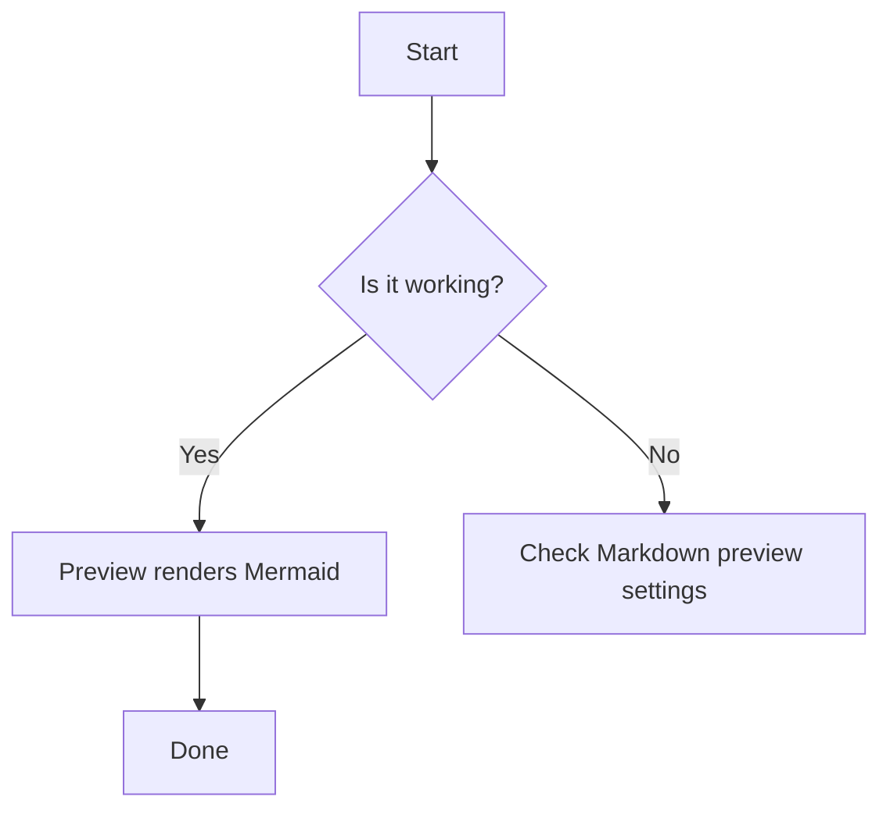

# Markdown Preview Mermaid Support

This file demonstrates Mermaid support in Markdown preview.

```mermaid
flowchart TD
    A[Start] --> B{Is it working?}
    B -- Yes --> C[Preview renders Mermaid]
    B -- No --> D[Check Markdown preview settings]
    C --> E[Done]
```

You can open the Markdown preview in VS Code and the Mermaid diagram above should render.
