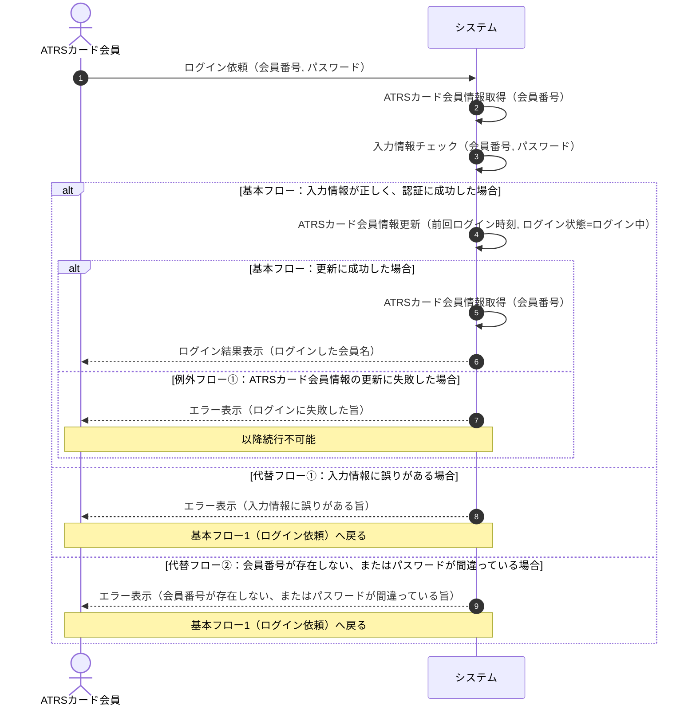
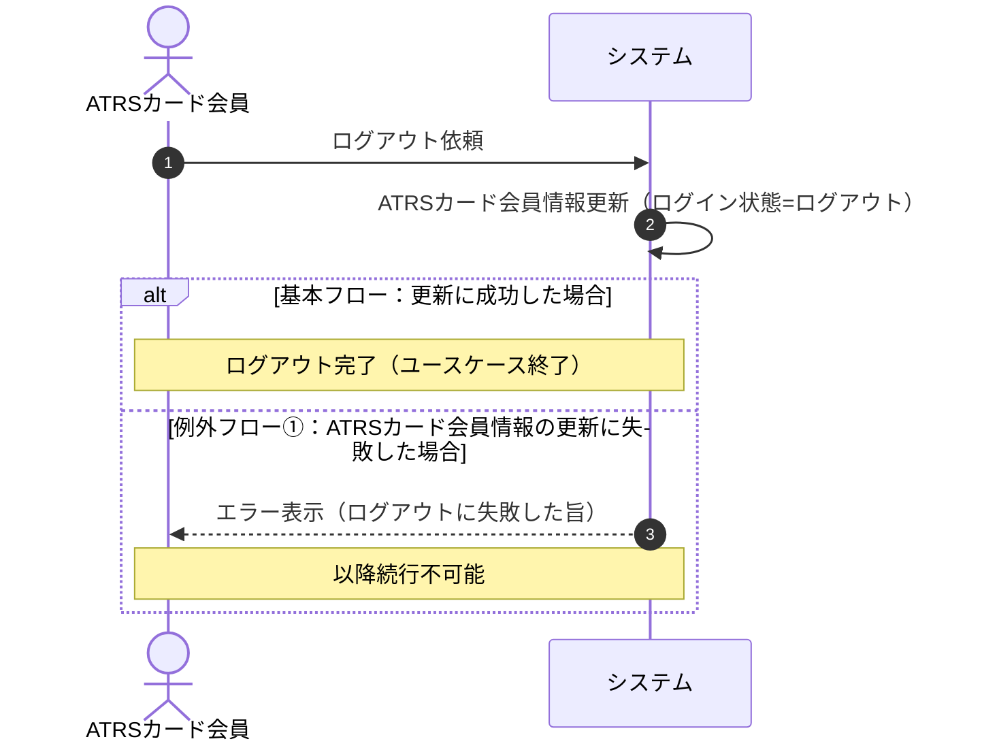

# シーケンス図（Sequence Diagram）：ログイン・ログアウト

## 0. 文書情報

| 項目 | 内容 |
|---|---|
| 対象仕様 | ユースケース仕様「ログインする（A03-01）」「ログアウトする（A03-02）」 |
| 対象システム | ATRS（航空チケット予約システム） |
| 作成工程 | シーケンス図テストモデル設計 |
| 作成日 | 2026-10-06 |

## 1. ログインする（A03-01）

## 2. ログアウトする（A03-02）

## 3. 設計上の判断

- ライフラインは「ATRSカード会員」と「システム」の2者に限定し、会員情報の取得・チェック・更新はシステムの自己メッセージで表現する。
- ログインは「入力チェック／認証（基本フロー2）」と「会員情報更新（基本フロー3）」の2段階で分岐するため、alt を入れ子にする。
- 代替フロー①と②の境界は仕様上明記されていないため、次のように解釈する（要確認事項）。
  - 代替フロー①：形式チェック（必須、桁数、文字種など）での誤り
  - 代替フロー②：認証での誤り（会員番号が存在しない、またはパスワードが違う）
- 「基本フロー1へ戻る」は、alt/else で表現するという指定を優先し、loop ではなく Note で表す。
- ログアウト成功時の表示内容は仕様に記載がないため、メッセージは書かず Note で完了のみを示す（要確認事項）。

## 4. テストパス

| ID | ユースケース | パス | 期待結果 |
|---|---|---|---|
| L-01 | ログイン | 基本フロー | 会員名が表示され、前回ログイン時刻とログイン状態が更新される |
| L-02 | ログイン | 代替フロー① | 入力誤りが表示され、ログイン入力に戻る（会員情報は更新されない） |
| L-03 | ログイン | 代替フロー②（会員番号が存在しない） | 認証エラーが表示され、ログイン入力に戻る |
| L-04 | ログイン | 代替フロー②（パスワード誤り） | 認証エラーが表示され、ログイン入力に戻る |
| L-05 | ログイン | 例外フロー① | ログイン失敗が表示され、続行できない |
| O-01 | ログアウト | 基本フロー | ログイン状態がログアウトに更新される |
| O-02 | ログアウト | 例外フロー① | ログアウト失敗が表示され、続行できない |
