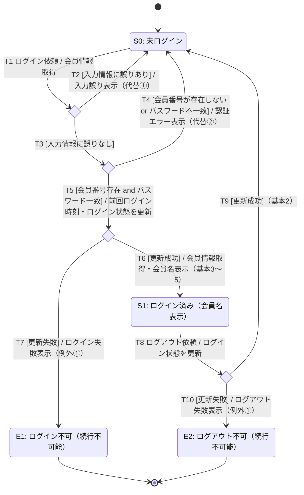

# 状態遷移（State Transition）：ログイン・ログアウト

## 0. 文書情報

| 項目 | 内容 |
|---|---|
| 対象仕様 | ユースケース仕様「ログインする（A03-01）」「ログアウトする（A03-02）」 |
| 対象システム | ATRS（航空チケット予約システム） |
| 作成工程 | 状態遷移テストモデル設計 |
| 作成日 | 2026-10-06 |

## 1. 状態の識別

画面上から観測できる安定状態だけを「状態」とし、システム内部の判定はチョイス（分岐点）としてガード条件付きで表す。

| ID | 状態 | 説明 |
|---|---|---|
| S0 | 未ログイン | ログイン情報を入力できる状態。代替フロー①②で戻る先もここ |
| S1 | ログイン済み | 会員名が表示されている状態 |
| E1 | ログイン不可（異常終了） | ログイン失敗を表示した後、続行できない状態 |
| E2 | ログアウト不可（異常終了） | ログアウト失敗を表示した後、続行できない状態 |
| C1〜C4 | 判定（チョイス） | 入力チェック、認証、会員情報更新（ログイン時）、会員情報更新（ログアウト時）の分岐点 |

## 2. 状態遷移図

遷移ラベルは `イベント [ガード] / アクション` の形式。

## 3. 遷移とフローの対応

| 遷移 | 対応するフロー | 遷移元 → 遷移先 |
|---|---|---|
| T1, T3, T5, T6 | A03-01 基本フロー | S0 → S1 |
| T1, T2 | A03-01 代替フロー① | S0 → S0 |
| T1, T3, T4 | A03-01 代替フロー② | S0 → S0 |
| T1, T3, T5, T7 | A03-01 例外フロー① | S0 → E1 |
| T8, T9 | A03-02 基本フロー | S1 → S0 |
| T8, T10 | A03-02 例外フロー① | S1 → E2 |

## 4. カバレッジの目安

### 0スイッチ網羅（全遷移 T1〜T10 を1回以上通す）：最小4本

| No | シナリオ | 通過する遷移 |
|---|---|---|
| 1 | 代替① → 再入力して基本ログイン → 基本ログアウト | T1, T2, T3, T5, T6, T8, T9 |
| 2 | 代替② → 再入力して基本ログイン | T1, T3, T4, T5, T6 |
| 3 | 例外ログイン | T1, T3, T5, T7 |
| 4 | 基本ログイン → 例外ログアウト | T1, T3, T5, T6, T8, T10 |

### 1スイッチ網羅の候補

- 代替① → 代替② の連続（T2 → T1 → T3 → T4）
- 代替② → 代替① の連続（T4 → T1 → T2）
- ログアウト → 再ログイン（T9 → T1）

## 5. 仕様の曖昧な点（要確認事項）

| No | 内容 | 本モデルでの仮定 |
|---|---|---|
| Q1 | 基本フロー2で「入力チェック」と「認証」の順序が不明。入力誤りと認証エラーが同時に起きた場合、どちらのメッセージが優先されるか未定義 | 形式チェック → 認証の順 |
| Q2 | A03-01 基本フロー4（会員情報取得）の失敗時の例外フローが未定義 | モデルに含めない |
| Q3 | ログアウト成功後の表示内容が未定義 | S0（未ログイン）に戻る |
| Q4 | 無効なイベント（ログイン済み状態でのログイン依頼、未ログイン状態でのログアウト依頼）の扱いが未定義 | 状態遷移表では N/A とし、無視されることを確認するテストを検討 |
| Q5 | ログイン失敗の回数制限（アカウントロック等）の記述がない | S0 への自己ループは何回でも繰り返せる |
| Q6 | 異常終了（E1/E2）後の遷移先が未定義（「以降続行不可能」のみ） | 終了状態とする |
