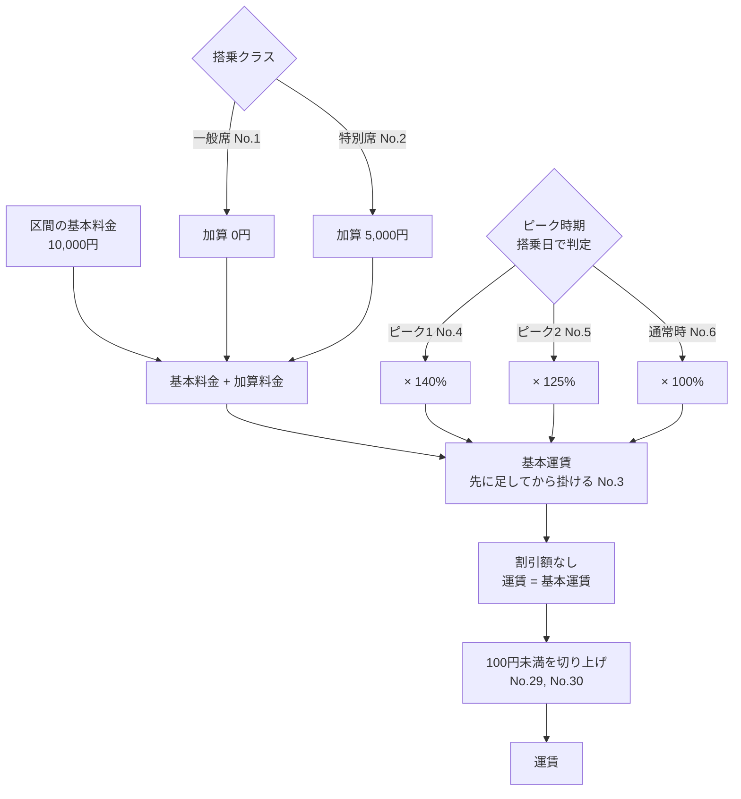
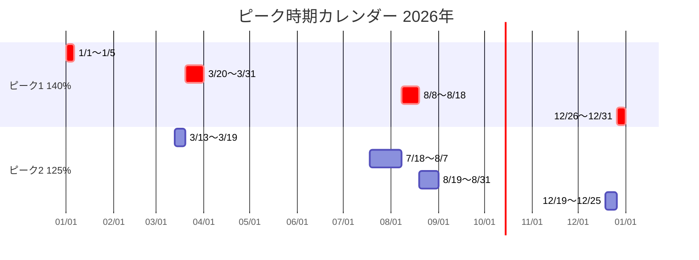
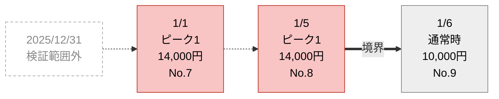
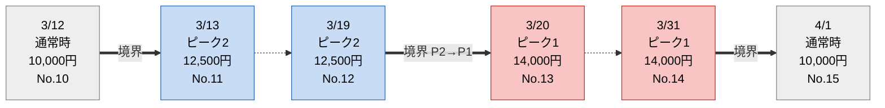
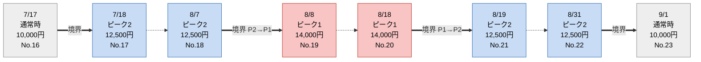
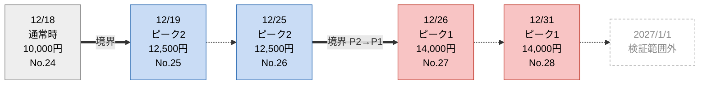
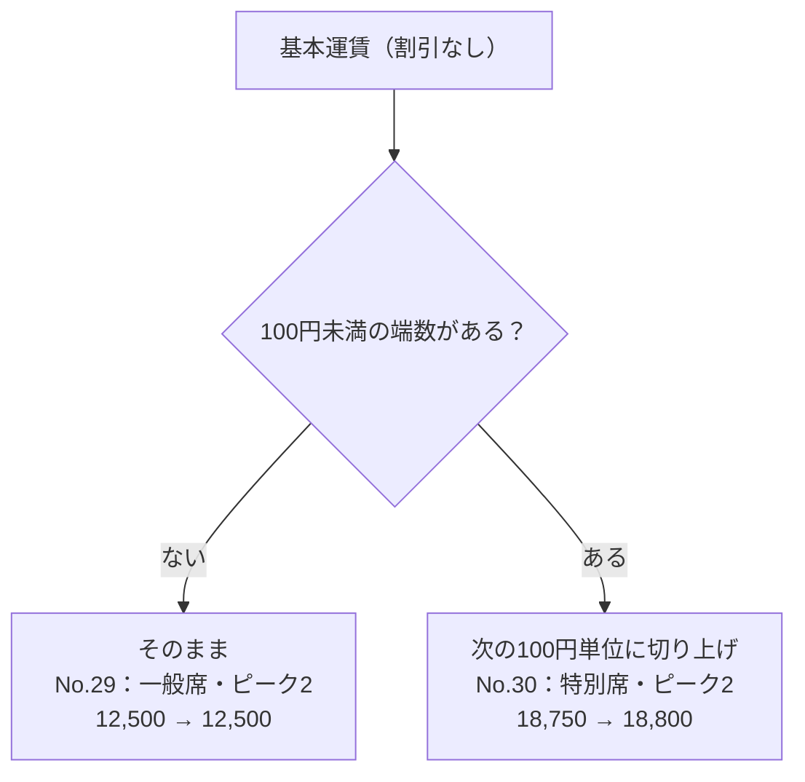
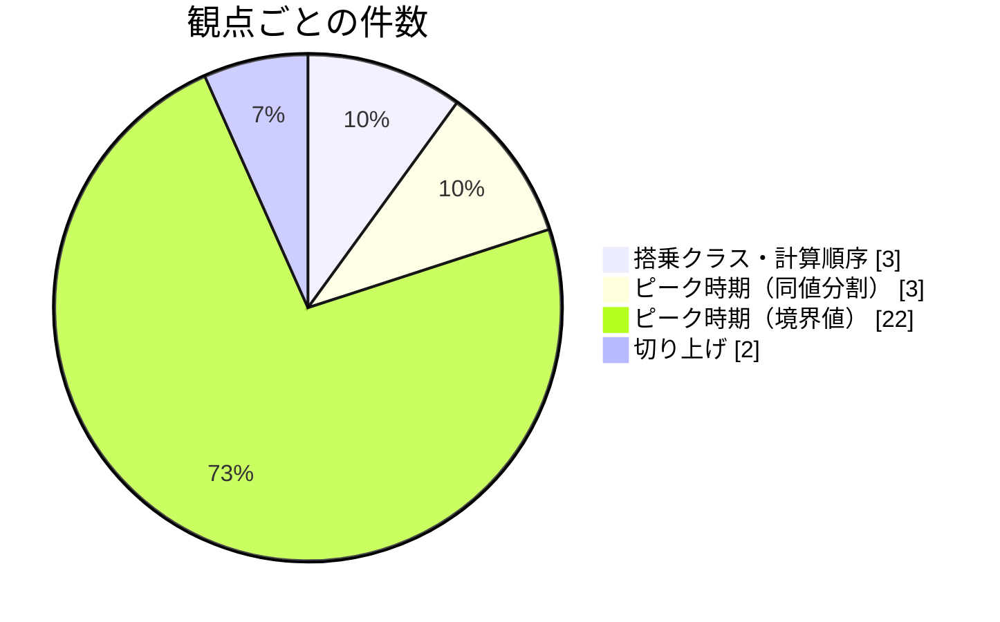

# テスト条件一覧（運賃算出ルール）

## 前提（不明点への回答を反映）

| No. | 確認事項 | 回答（2026-10-06） | テスト条件への反映 |
|---|---|---|---|
| 1 | 区間ごとの基本料金 | 10,000円で計算 | すべての行で B=10,000円 |
| 2 | 運賃種別と割引額 | 割引額なし | 運賃＝基本運賃（端数処理後）。運賃種別の条件は作らない |
| 3 | 1円未満の端数・途中段階の丸め | 1円未満の端数は丸める | 下の「計算一覧」のとおり、6通りすべてで1円未満の端数は**発生しない**ため、テスト条件は作らない |
| 4 | 運賃が0円以下になる場合 | 考慮しない | 条件は作らない |
| 5 | ピーク時期の判定基準日 | 搭乗日 | 入力値例の日付はすべて搭乗日 |
| 6 | 一般席・特別席以外のクラス | なし | 無効クラスの条件は作らない |
| 7 | 期間指定の適用年 | 今年のみ。検証範囲も今年のみ | 本日（2026-10-06）を基準に**2026年**として作成。2025年・2027年の日付は範囲外 |

### 計算一覧（入力の全組み合わせ）

基本料金と割引額が決まったため、運賃の取りうる値は次の6通りだけです。

| 搭乗クラス | 時期 | 計算 | 基本運賃 | 100円未満 | 運賃 |
|---|---|---|---|---|---|
| 一般席 | 通常時 | (10,000+0)×100% | 10,000 | なし | 10,000 |
| 一般席 | ピーク2 | (10,000+0)×125% | 12,500 | なし | 12,500 |
| 一般席 | ピーク1 | (10,000+0)×140% | 14,000 | なし | 14,000 |
| 特別席 | 通常時 | (10,000+5,000)×100% | 15,000 | なし | 15,000 |
| 特別席 | ピーク2 | (10,000+5,000)×125% | 18,750 | **あり（50円）** | **18,800** |
| 特別席 | ピーク1 | (10,000+5,000)×140% | 21,000 | なし | 21,000 |

## 図解

図中の「No.」はテスト条件表の「#」に対応します。

### 図1：運賃の計算の流れとテスト条件

### 図2：ピーク時期カレンダー（2026年）

赤がピーク1（140%）、青がピーク2（125%）です。どちらにも入らない日は通常時（100%）です。

### 図3：境界値テストの日付（2026年・一般席）

太い矢印は「翌日に区分が切り替わる境界」、点線は「同じ期間の中で日付を飛ばしている」ことを表します。灰色の点線枠は検証範囲外（2026年以外）です。

**1月**

**3月〜4月**

**7月〜9月**

**12月**

### 図4：100円未満切り上げのテスト条件

### 図5：観点ごとの件数（全30件）

## テスト条件表

共通の入力：基本料金 10,000円、割引額なし、日付は2026年の搭乗日。

| # | 観点 | テスト条件 | 入力値例 | 期待結果（運賃） | 仕様書の記載場所 | 根拠 | 判定 |
|---|---|---|---|---|---|---|---|
| 1 | 搭乗クラス（同値分割） | 一般席（加算0円） | 一般席／6月10日 | (10,000+0)×100%＝10,000円 | ■搭乗クラスの加算料金 | 表に「一般席 0」とある | OK |
| 2 | 搭乗クラス（同値分割） | 特別席（加算5,000円） | 特別席／6月10日 | (10,000+5,000)×100%＝15,000円 | ■搭乗クラスの加算料金 | 表に「特別席 5,000」とある | OK |
| 3 | 計算順序 | 加算料金を足してから比率を掛ける | 特別席／8月12日（ピーク1） | (10,000+5,000)×140%＝21,000円（誤った順序なら19,000円） | ■基本運賃の算出方法 | 式のかっこで順序が決まる | OK |
| 4 | ピーク時期（同値分割） | ピーク1の期間内 | 一般席／8月12日 | 14,000円 | ■ピーク時期別の積算比率 | ピーク1 8月8日〜18日 → 140% | OK |
| 5 | ピーク時期（同値分割） | ピーク2の期間内 | 一般席／7月25日 | 12,500円 | 同上 | ピーク2 7月18日〜8月7日 → 125% | OK |
| 6 | ピーク時期（同値分割） | 通常時 | 一般席／6月10日（#1と同じ入力） | 10,000円 | 同上 | 「上記以外」→ 100% | OK |
| 7 | ピーク時期（境界値） | ピーク1 開始日（前日は2025年で範囲外） | 一般席／1月1日 | ピーク1：14,000円 | 同上・回答7 | 1月1日〜1月5日 | OK |
| 8 | ピーク時期（境界値） | ピーク1 終了日 | 一般席／1月5日 | ピーク1：14,000円 | 同上 | 同上 | OK |
| 9 | ピーク時期（境界値） | ピーク1 終了日の翌日 | 一般席／1月6日 | 通常時：10,000円 | 同上 | どの期間にも入らない | OK |
| 10 | ピーク時期（境界値） | ピーク2 開始日の前日 | 一般席／3月12日 | 通常時：10,000円 | 同上 | どの期間にも入らない | OK |
| 11 | ピーク時期（境界値） | ピーク2 開始日 | 一般席／3月13日 | ピーク2：12,500円 | 同上 | 3月13日〜19日 | OK |
| 12 | ピーク時期（境界値・ピーク1/2隣接） | ピーク2 終了日 | 一般席／3月19日 | ピーク2：12,500円 | 同上 | 同上 | OK |
| 13 | ピーク時期（境界値・ピーク1/2隣接） | ピーク1 開始日 | 一般席／3月20日 | ピーク1：14,000円 | 同上 | 3月20日〜31日 | OK |
| 14 | ピーク時期（境界値） | ピーク1 終了日 | 一般席／3月31日 | ピーク1：14,000円 | 同上 | 「3月20日〜31日」を同じ月の31日と解釈 | OK |
| 15 | ピーク時期（境界値） | ピーク1 終了日の翌日 | 一般席／4月1日 | 通常時：10,000円 | 同上 | どの期間にも入らない | OK |
| 16 | ピーク時期（境界値） | ピーク2 開始日の前日 | 一般席／7月17日 | 通常時：10,000円 | 同上 | どの期間にも入らない | OK |
| 17 | ピーク時期（境界値） | ピーク2 開始日 | 一般席／7月18日 | ピーク2：12,500円 | 同上 | 7月18日〜8月7日 | OK |
| 18 | ピーク時期（境界値・ピーク1/2隣接） | ピーク2 終了日 | 一般席／8月7日 | ピーク2：12,500円 | 同上 | 同上 | OK |
| 19 | ピーク時期（境界値・ピーク1/2隣接） | ピーク1 開始日 | 一般席／8月8日 | ピーク1：14,000円 | 同上 | 8月8日〜18日 | OK |
| 20 | ピーク時期（境界値・ピーク1/2隣接） | ピーク1 終了日 | 一般席／8月18日 | ピーク1：14,000円 | 同上 | 同上 | OK |
| 21 | ピーク時期（境界値・ピーク1/2隣接） | ピーク2 開始日 | 一般席／8月19日 | ピーク2：12,500円 | 同上 | 8月19日〜31日 | OK |
| 22 | ピーク時期（境界値） | ピーク2 終了日 | 一般席／8月31日 | ピーク2：12,500円 | 同上 | 同上 | OK |
| 23 | ピーク時期（境界値） | ピーク2 終了日の翌日 | 一般席／9月1日 | 通常時：10,000円 | 同上 | どの期間にも入らない | OK |
| 24 | ピーク時期（境界値） | ピーク2 開始日の前日 | 一般席／12月18日 | 通常時：10,000円 | 同上 | どの期間にも入らない | OK |
| 25 | ピーク時期（境界値） | ピーク2 開始日 | 一般席／12月19日 | ピーク2：12,500円 | 同上 | 12月19日〜25日 | OK |
| 26 | ピーク時期（境界値・ピーク1/2隣接） | ピーク2 終了日 | 一般席／12月25日 | ピーク2：12,500円 | 同上 | 同上 | OK |
| 27 | ピーク時期（境界値・ピーク1/2隣接） | ピーク1 開始日 | 一般席／12月26日 | ピーク1：14,000円 | 同上 | 12月26日〜31日 | OK |
| 28 | ピーク時期（境界値） | ピーク1 終了日（翌日は2027年で範囲外） | 一般席／12月31日 | ピーク1：14,000円 | 同上・回答7 | 同上 | OK |
| 29 | 切り上げ（100円未満なし） | 100円未満の端数が出ない | 一般席／7月25日（ピーク2） | 12,500円（切り上げない） | ■運賃の算出方法 ※ | 12,500は100円未満が0円 | OK |
| 30 | 切り上げ（100円未満あり） | 100円未満の端数が出る | 特別席／7月25日（ピーク2） | 18,750 → 18,800円 | ■運賃の算出方法 ※ | 100円未満の50円を切り上げ。6通りの中でこの組み合わせだけ | OK |

## 前回から外した条件

| 前回の# | 条件 | 外した理由 |
|---|---|---|
| 3 | 一般席・特別席以外のクラス | 回答6：クラスは2つだけ |
| 8 の一部 | 1月1日の前日（12月31日） | 前日は2025年12月31日で、回答7により範囲外。12月31日は「12月26日〜31日の終了日」として #28 に残した |
| 30 | うるう日（2月29日） | 2026年はうるう年ではなく、2月29日がない |
| 31〜34 | 端数処理前が 10,000／10,001／10,099／10,100 円 | 回答1・2で、運賃は上の「計算一覧」の6通りに限られる。10,001円や10,099円は入力では作れないため、#29・#30 に置き換えた |
| 35 | 1円未満の端数 | 6通りすべてで1円未満の端数が出ない |
| 36 | 切り上げを適用する段階 | 回答2：割引なしなので、基本運賃と割引後の運賃が同じ値になる |
| 37 | 運賃種別ごとの割引額 | 回答2：割引なし |
| 38 | 運賃が0円以下 | 回答4：考慮しない |
| 39 | 時期の判定基準日 | 回答5：搭乗日。全行の入力値に反映した |

## チェックリストとの照合

| チェック項目 | 対応する# | 結果 |
|---|---|---|
| 一般席（加算0円） | 1 | OK |
| 特別席（加算5,000円） | 2 | OK |
| ピーク1・ピーク2・通常時の3区分 | 4, 5, 6 | OK |
| 開始日の前日と開始日（例：12/25 と 12/26） | 10/11, 12/13, 16/17, 18/19, 20/21, 24/25, 26/27 | OK（ピーク1の1月1日だけは前日が範囲外） |
| 終了日と翌日（例：1/5 と 1/6） | 8/9, 12/13, 14/15, 18/19, 20/21, 22/23, 26/27 | OK（ピーク1の12月31日だけは翌日が範囲外） |
| ピーク1とピーク2が隣接する境界（例：3/19 と 3/20） | 12/13, 18/19, 20/21, 26/27 | OK（隣接4か所すべて） |
| 100円未満が出るケースと出ないケース | 出る：30／出ない：29 | OK |
