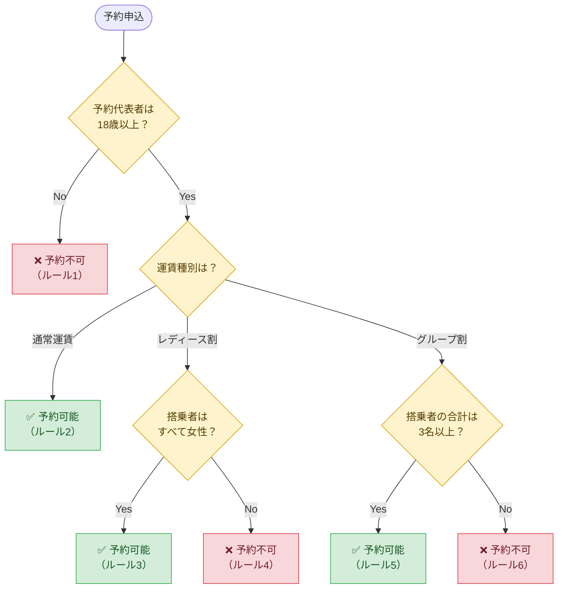
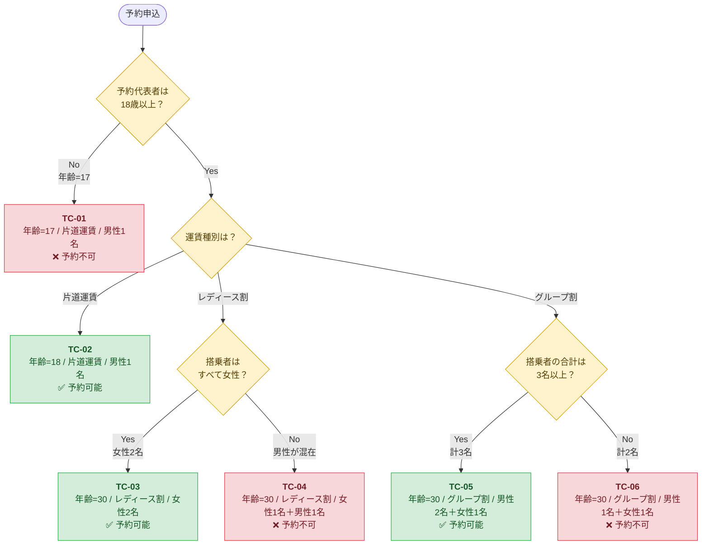
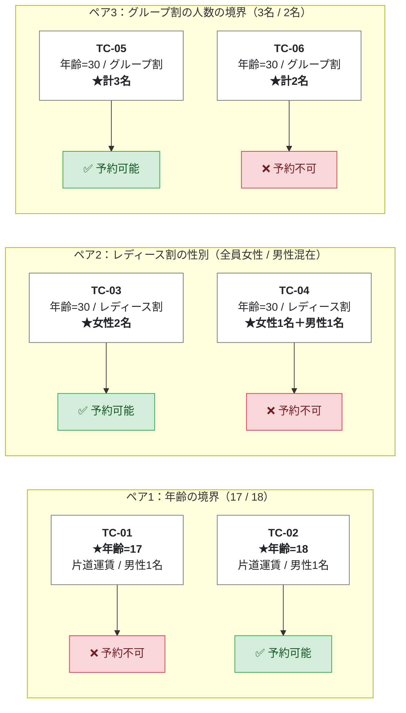
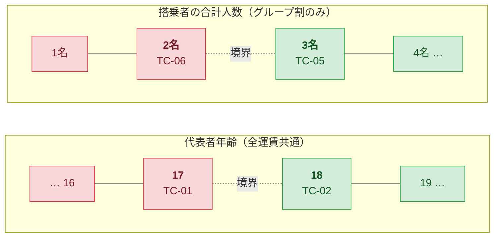

# デシジョンテーブル（詳細予約規定）

## 対象のビジネスルール

搭乗者・予約代表者は以下の条件を満たす必要がある。

1. 予約代表者の年齢は 18 歳以上であること。
2. 運賃種別がレディース割の場合、搭乗者の性別はすべて女性であること。
3. 運賃種別がグループ割の場合、搭乗者の合計数が 3 名以上であること（グループ割の利用可能最少人数は3名）。

※ レディース割とグループ割を同時に選択することはできない。

## 前提

- 運賃種別は「通常運賃 / レディース割 / グループ割」の3つで、同時には1つしか選べない。
- 「通常運賃」は、レディース割・グループ割のどちらでもない運賃（例：片道運賃）を指す。
- 表の値の意味：**Y** = 条件を満たす、**N** = 満たさない、**-** = 結果に関係しない、**○** = 予約可能、**×** = 予約不可。

## デシジョンテーブル（簡略化後）

| | ルール1 | ルール2 | ルール3 | ルール4 | ルール5 | ルール6 |
|---|:---:|:---:|:---:|:---:|:---:|:---:|
| **【条件】** | | | | | | |
| 予約代表者が18歳以上 | N | Y | Y | Y | Y | Y |
| 運賃種別がレディース割 | - | N | Y | Y | N | N |
| 運賃種別がグループ割 | - | N | N | N | Y | Y |
| 搭乗者がすべて女性 | - | - | Y | N | - | - |
| 搭乗者の合計が3名以上 | - | - | - | - | Y | N |
| **【結果】** | | | | | | |
| 予約可能 | × | ○ | ○ | × | ○ | × |
| **【入力値の具体例】** | | | | | | |
| 代表者年齢 | 17 | 18 | 30 | 30 | 30 | 30 |
| 運賃種別 | 片道運賃 | 片道運賃 | レディース割 | レディース割 | グループ割 | グループ割 |
| 搭乗者 | 男性1名 | 男性1名 | 女性2名 | 女性1名＋男性1名 | 男性2名＋女性1名（計3名） | 男性1名＋女性1名（計2名） |

### 各ルールの意味

| ルール | 内容 | 結果 |
|---|---|---|
| 1 | 代表者が18歳未満（運賃種別などは関係なし） | 予約不可 |
| 2 | 代表者が18歳以上で通常運賃 | 予約可能 |
| 3 | 代表者が18歳以上、レディース割で搭乗者が全員女性 | 予約可能 |
| 4 | 代表者が18歳以上、レディース割で男性が含まれる | 予約不可 |
| 5 | 代表者が18歳以上、グループ割で3名以上 | 予約可能 |
| 6 | 代表者が18歳以上、グループ割で2名以下 | 予約不可 |

### 簡略化のポイント

- **ルール1**：18歳未満なら他の条件に関係なく予約できないので、残りはすべて「-」にまとめた。
- **性別の条件**はレディース割のときだけ、**人数の条件**はグループ割のときだけ結果に影響する。それ以外のルールでは「-」。
- レディース割とグループ割の両方が「Y」の組み合わせは選べないため、表には入れていない。

## 判定フロー

### 図の見方

- **黄色のひし形**：判定する条件
- **緑の箱**：予約可能（ルール2・3・5）
- **赤の箱**：予約不可（ルール1・4・6）
- ゴール（色付きの箱）は6つあり、デシジョンテーブルのルール1〜6と1対1で対応する。

### 表の「-」が図ではどう表れるか

| 表の「-」 | 図での表れ方 |
|---|---|
| ルール1で年齢以外が「-」 | 「18歳以上？」でNoならすぐ終わり、他の条件は確かめない |
| ルール2で性別・人数が「-」 | 通常運賃の道には性別・人数の判定がない |
| ルール3・4で人数が「-」 | レディース割の道には人数の判定がない |
| ルール5・6で性別が「-」 | グループ割の道には性別の判定がない |

## 必要なテストケース数

**6件**（簡略化後のルール1〜6に1件ずつ）。

参考：簡略化前の全組み合わせは、代表者年齢2通り × 運賃種別3通り × 性別2通り × 人数2通り = **24通り**。これを「-」でまとめて6件に減らしている。

## テストケース（入力値の具体例）

| No | ルール | 代表者年齢 | 運賃種別 | 搭乗者 | 期待結果 | 入力値を選んだ理由 |
|---|---|---|---|---|---|---|
| TC-01 | ルール1 | **17** | 片道運賃 | 男性1名 | ❌ 予約不可 | 年齢の境界値（18歳の1つ下） |
| TC-02 | ルール2 | **18** | 片道運賃 | 男性1名 | ✅ 予約可能 | 年齢の境界値（ちょうど18歳）。TC-01との違いは年齢だけ |
| TC-03 | ルール3 | 30 | レディース割 | 女性2名 | ✅ 予約可能 | 複数名でも全員女性なら予約できることを確かめる |
| TC-04 | ルール4 | 30 | レディース割 | 女性1名＋**男性1名** | ❌ 予約不可 | 男性が1名でも混じれば予約できないことを確かめる。TC-03との違いは性別だけ |
| TC-05 | ルール5 | 30 | グループ割 | 男性2名＋女性1名（計**3名**） | ✅ 予約可能 | 人数の境界値（最少人数ちょうど）。男女が混ざっても性別は関係しないことも確かめる |
| TC-06 | ルール6 | 30 | グループ割 | 男性1名＋女性1名（計**2名**） | ❌ 予約不可 | 人数の境界値（最少人数の1つ下）。TC-05との違いは人数だけ |

※ 結果に関係しない条件（「-」の部分）は、ほかのテストケースと同じ値にそろえた。こうすると、失敗したときに原因の条件をすぐ特定できる。

### 図解①：各テストケースが通る道

判定フローの上に、テストケース（TC-01〜06）の入力値を重ねた図。6件で、ゴールがすべて1回ずつ通られることがわかる。

### 図解②：ペアで「1か所だけ」変えている値

TC-01〜06は2件ずつのペアになっていて、ペアの中で違う値は1つだけ（★印の部分）。結果が○と×に分かれたら、その1つの値が原因だと言い切れる。

### 図解③：境界値の位置

年齢と人数について、どこが「予約可能」と「予約不可」の分かれ目で、どの値をテストしているかを示した図。

- 赤：予約不可になる値、緑：予約可能になる値
- 境界の両側（17と18、2名と3名）を1件ずつテストしている。たとえば実装が「18歳超」や「3名超」と間違っていても、TC-02やTC-05が失敗するので見つけられる。
