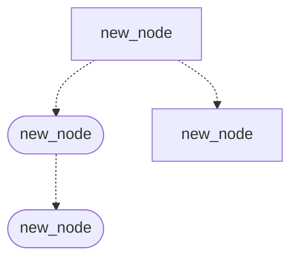

# 運賃算出 テスト条件

前提：特に記載がない行は「区間の基本料金 = 10,000円」「一般席」「通常時」「割引額 = 0円」で計算しています。

| # | 観点 | テスト条件 | 入力値例 | 期待結果 |
|---|---|---|---|---|
| 1 | 同値分割：搭乗クラス | 一般席（加算料金 0円） | 一般席 | (10,000+0)×100% = 10,000円 |
| 2 | 同値分割：搭乗クラス | 特別席（加算料金 5,000円） | 特別席 | (10,000+5,000)×100% = 15,000円 |
| 3 | 同値分割：時期区分 | ピーク1の代表値 | 8月12日 | 10,000×140% = 14,000円 |
| 4 | 同値分割：時期区分 | ピーク2の代表値 | 7月31日 | 10,000×125% = 12,500円 |
| 5 | 同値分割：時期区分 | 通常時の代表値 | 6月15日 | 10,000×100% = 10,000円 |
| 6 | 境界値：ピーク1（1/1〜1/5） | 下限 | 1月1日 | 14,000円 |
| 7 | 境界値：ピーク1（1/1〜1/5） | 上限 | 1月5日 | 14,000円 |
| 8 | 境界値：ピーク1（1/1〜1/5） | 上限+1日 | 1月6日 | 10,000円（通常時） |
| 9 | 境界値：ピーク2（3/13〜3/19） | 下限-1日 | 3月12日 | 10,000円（通常時） |
| 10 | 境界値：ピーク2（3/13〜3/19） | 下限 | 3月13日 | 12,500円 |
| 11 | 境界値：ピーク2→ピーク1 | ピーク2の上限 | 3月19日 | 12,500円 |
| 12 | 境界値：ピーク2→ピーク1 | ピーク1の下限 | 3月20日 | 14,000円 |
| 13 | 境界値：ピーク1（3/20〜3/31） | 上限 | 3月31日 | 14,000円 |
| 14 | 境界値：ピーク1（3/20〜3/31） | 上限+1日 | 4月1日 | 10,000円（通常時） |
| 15 | 境界値：ピーク2（7/18〜8/7） | 下限-1日 | 7月17日 | 10,000円（通常時） |
| 16 | 境界値：ピーク2（7/18〜8/7） | 下限 | 7月18日 | 12,500円 |
| 17 | 境界値：ピーク2→ピーク1 | ピーク2の上限 | 8月7日 | 12,500円 |
| 18 | 境界値：ピーク2→ピーク1 | ピーク1の下限 | 8月8日 | 14,000円 |
| 19 | 境界値：ピーク1→ピーク2 | ピーク1の上限 | 8月18日 | 14,000円 |
| 20 | 境界値：ピーク1→ピーク2 | ピーク2の下限 | 8月19日 | 12,500円 |
| 21 | 境界値：ピーク2（8/19〜8/31） | 上限 | 8月31日 | 12,500円 |
| 22 | 境界値：ピーク2（8/19〜8/31） | 上限+1日 | 9月1日 | 10,000円（通常時） |
| 23 | 境界値：ピーク2（12/19〜12/25） | 下限-1日 | 12月18日 | 10,000円（通常時） |
| 24 | 境界値：ピーク2（12/19〜12/25） | 下限 | 12月19日 | 12,500円 |
| 25 | 境界値：ピーク2→ピーク1 | ピーク2の上限 | 12月25日 | 12,500円 |
| 26 | 境界値：ピーク2→ピーク1 | ピーク1の下限 | 12月26日 | 14,000円 |
| 27 | 境界値：ピーク1（12/26〜12/31） | 上限 | 12月31日 | 14,000円 |
| 28 | 組合せ：クラス×時期 | 特別席×ピーク1 | 特別席、8月12日 | (10,000+5,000)×140% = 21,000円 |
| 29 | 組合せ：クラス×時期 | 特別席×ピーク2 | 特別席、7月31日 | (10,000+5,000)×125% = 18,750 → 18,800円 |
| 30 | 境界値：100円未満切り上げ | 100円未満の端数が0円 | 基本料金 10,100円 | 10,100円（切り上げない） |
| 31 | 境界値：100円未満切り上げ | 100円未満の端数が1円 | 基本料金 10,101円 | 10,200円 |
| 32 | 境界値：100円未満切り上げ | 100円未満の端数が99円 | 基本料金 10,199円 | 10,200円 |
| 33 | 境界値：100円未満切り上げ | 比率計算後に100円未満の端数が出ない | 基本料金 10,080円、ピーク2 | 10,080×125% = 12,600円 |
| 34 | 境界値：100円未満切り上げ | 比率計算後に100円未満の端数が出る | 基本料金 10,081円、ピーク2 | 10,081×125% = 12,601.25 → 12,700円 |
| 35 | 同値分割：割引額 | 割引額が0円 | 割引額 0円 | 10,000 − 0 = 10,000円 |
| 36 | 同値分割：割引額 | 割引額がある | 割引額 1,000円 | 10,000 − 1,000 = 9,000円 |
| 37 | 境界値：割引後の切り上げ | 割引後に100円未満の端数が出る | 割引額 1円 | 10,000 − 1 = 9,999 → 10,000円 |
| 38 | 計算順序：切り上げのタイミング | 切り上げは「基本運賃 − 割引額」の後に行う | 基本料金 10,050円、割引額 50円 | 10,050 − 50 = 10,000円 |

**補足**
- 仕様には運賃種別ごとの割引額が書かれていません。そのため #35〜38 は運賃種別ではなく、割引額そのものを入力値にしています。
- 割引額の一覧がわかれば、運賃種別ごとの同値クラスを追加できます。
